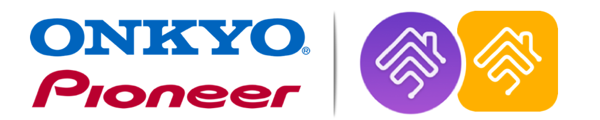
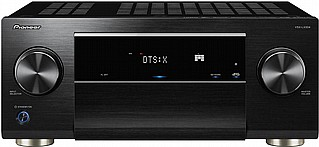

## ~~~~~~~~ UNDER DEVELOPMENT ~~~~~~~~
______________

# homebridge-onkyo-pioneer

 
<!--   
  -->

[Homebridge](https://github.com/nfarina/homebridge) plugin for Onkyo and Pioneer Audio Receivers

  

### Requirements

 &nbsp;

check with: `node -v` & `homebridge -V` and update if needed

\* All devices are controlled via onkyo eiscp protocol (must be supported) 
\* Pioneer support is only for audio receivers that are controlled by "Pioneer Remote App"

## Support homebridge-onkyo-pioneer

**homebridge-onkyo-pioneer** is a free plugin under the MIT license. it was developed as a contribution to the homebridge/hoobs community with lots of love and thoughts.
Creating and maintaining Homebridge plugins consume a lot of time and effort and if you would like to share your appreciation, feel free to "Star" or donate.

 
 
